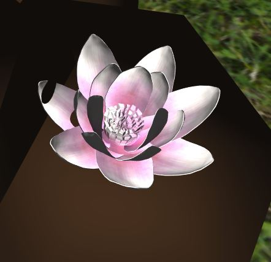
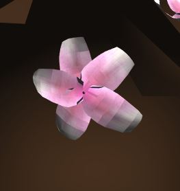
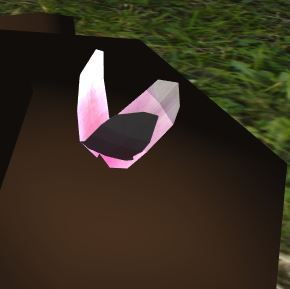

# Procedural Tree - L-systems

* *Jiawei Wang, CGGT, University of Pennsylvania*
* *Pennkey: jiaww*

## Overview
The project is to create a **procedural tree** using **L-system**, developed in WebGL. Here is the final rendering:

|**Final Result [Iteration=8]**|
|---|
||

## L-System Rules:
* **`F`**: Move Forward by `DefaultStep` and Create a Branch(Cylinder)
* **`f`**: Move Forward by `DefaultStep`
* **`+`**: Rotate along Up-Axis for `DefaultAngle` degrees
* **`-`**: Rotate along Up-Axis for `-DefaultAngle` degrees
* **`&`**: Rotate along Left-Axis for `DefaultAngle` degrees
* **`^`**: Rotate along Left-Axis for `-DefaultAngle` degrees
* **`\\`**: Rotate along Forward-Axis for `DefaultAngle` degrees
* **`/`**: Rotate along Forward-Axis for `-DefaultAngle` degrees
* **`|`**: Rotate along Up-Axis for `180` degrees
* **`[`**: Push current Turtle into stack
* **`]`**: Pop Turtle from stack
* **`*`**: Create Flower on current position
* **Others**: Do nothing

## Implement Details
* **Big VBO**: Instead of using one vbo for each mesh(cylinder or flower), here we use one big VBO for all mesh. It means we will compute the transform results before we write into VBO, and we only need one draw call to render all of the meshes. Although it will increase the memory usage, it can make the rendering much faster.
* **About the requirement of the linked list**: Here I am not using link list to store and expand the L-system program, I think it's unnecessary to use link-list since the string can also perform really good for such situation.
* **Wind**: I use Vertex Animation here, just follow the instruction on [*Gem 3, Chapter 16*](https://developer.nvidia.com/gpugems/GPUGems3/gpugems3_ch16.html), I only implement the branch bending part in the shader.
* **Branch Generation**: I write my own implementation of cylinder generation, which is more easy to create different top and bottom radius of the branch. (The higher the depth, the thinner the branch, which can be modify by the parameter `ShrinkExp`)
* **OBJ Loading**: I use webgl-obj-loader for the .obj loading. There are 4 levels of detail of the flower, because the high-poly flower may cause the memory crash(too many triangles).

|**LOD0**|**LOD1**|**LOD2**|**LOD3**|
|---|---|---|---|
|||||

* **Randomess of the flowers**: The flowers' sizes and directions are random to make the 
* A second Rule-style class that dictates what drawing operation should be
performed when a character is parsed during the drawing process. This should
also be a map of probabilities, but this time the values in the map will be
functions rather than strings. Invoke a given function, e.g. `drawBranch`, when
a character is parsed.
* A Turtle class that lets you keep track of, at minimum, a position, an
orientation, and a depth. You should also create a stack onto which you can push
and pop turtle states.
* A class in which to store the VBOs that will represent __all__ of your faceted
geometry. __Do not draw individual mesh components one at a time. This will
cause your program to render very slowly.__ Instead, expand lists of vertex
information as you "draw" your grammar, and push all VBO data to the GPU at once
after you've finished parsing your entire string for drawing.

## OBJ loading
So that you can more easily generate interesting-looking plants, we ask that you
enable your program to import OBJ files and store their information in VBOs. You
can either implement your own OBJ parser, or use an OBJ-loading package via NPM:

[obj-mtl-loader](https://www.npmjs.com/package/obj-mtl-loader)

[webgl-obj-loader](https://www.npmjs.com/package/webgl-obj-loader)

## Aesthetic Requirements
Your plant must have the following attributes:
* It must grow in 3D
* It must have flowers, leaves, or some other branch decoration in addition to
basic branch geometry
* Organic variation (i.e. noise or randomness in grammar expansion)
* A flavorful twist. Don't just make a basic variation on the example broccoli
grammar from the slides! Create a plant that is unique to you!

Feel free to use the resources linked in the slides for inspiration!

## Interactivity
Using dat.GUI, make at least three aspects of your demo an interactive variable.
For example, you could modify:

* The axiom
* Your input grammar rules and their probability
* The angle of rotation of the turtle
* The size or color or material of the cylinder the turtle draws

Don't feel restricted to these examples; make any attributes adjustable that you
want!

## Examples from last year (Click to go to live demo)

Andrea Lin:

Tabatha Hickman:

Joe Klinger:

## Extra Credit (Up to 20 points)
For bonus points, add functionality to your L-system drawing that ensures
geometry will never overlap. In other words, make your plant behave like a
real-life plant so that its branches and other components don't compete for the
same space. The more complex you make your L-system self-interaction, the more
points you'll earn.
