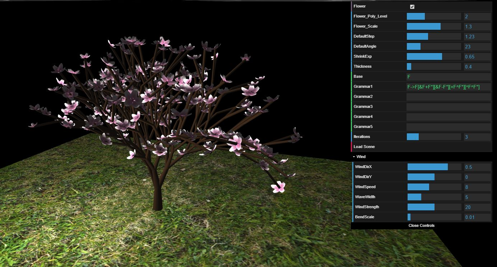

# Procedural Tree - L-systems

* *Jiawei Wang, CGGT, University of Pennsylvania*
* *Pennkey: jiaww*

## Overview
The project is to create a **procedural tree** using **L-system**, developed in WebGL. Here is the final rendering:

|**Final Result [Iteration=8]**|
|---|
||

* [Demo Link](https://jiaww.github.io/homework-4-l-systems-Jiaww/)

## L-System Rules:
* **`F`**: 
  * 80% Move Forward by `DefaultStep` and Create a Branch(Cylinder)
  * 20% Move Forward by `1.2 * DefaultStep` and Create a Branch(Cylinder)
* **`f`**: Move Forward by `DefaultStep`
* **`+`**: Rotate along Up-Axis for `DefaultAngle` degrees
* **`-`**: Rotate along Up-Axis for `-DefaultAngle` degrees
* **`&`**: Rotate along Left-Axis for `DefaultAngle` degrees
* **`^`**: Rotate along Left-Axis for `-DefaultAngle` degrees
* **`\\`**: Rotate along Forward-Axis for `DefaultAngle` degrees
* **`/`**: Rotate along Forward-Axis for `-DefaultAngle` degrees
* **`|`**: Rotate along Up-Axis for `180` degrees
* **`[`**: Push current Turtle into stack
* **`]`**: Pop Turtle from stack
* **`*`**: Create Flower on current position
* **Others**: Do nothing

## Results:
* If you wanna change any parameters related to L-System, you have to click **'Load Scene'** to make the changes happen.
* Program 1: follow the example of [Algorithmic Botany Book](http://algorithmicbotany.org/papers/abop/abop-ch1.pdf)
  * ω : `A`
  * p1 : `A → [&FL*A]/////’[&FL*A]///////’[&FL*A]`
  * p2 : `F → S ///// F`
  * p3 : `S → F L`
  * p4 : `L → [^^{-f+f+f-|-f+f+f}]`

|**Iteration=4 Flower=LOD0**|**Iteration=5 Flower=LOD1**|**Iteration=6 Flower=LOD2**|
|---|---|---|
||||

|**Iteration=7 Flower=LOD3**|**Iteration=8 Flower=LOD3**|
|---|---|
|||

* Program 2:
  * ω : `F`
  * p1 : `F → F[&F+F*][&F-F*][+F^F*][^F^F*]`
  
|**Result and Parameters**|
|---|
||

## Implement Details
* **Big VBO**: Instead of using one vbo for each mesh(cylinder or flower), here we use one big VBO for all mesh. It means we will compute the transform results before we write into VBO, and we only need one draw call to render all of the meshes. Although it will increase the memory usage, it can make the rendering much faster.
* **About the requirement of the linked list**: Here I am not using link list to store and expand the L-system program, I think it's unnecessary to use link-list since the string can also perform really good for such situation.
* **Wind**: I use Vertex Animation here, just follow the instruction on [*Gem 3, Chapter 16*](https://developer.nvidia.com/gpugems/GPUGems3/gpugems3_ch16.html), I only implement the branch bending part in the shader.
* **Branch Generation**: I write my own implementation of cylinder generation, which is more easy to create different top and bottom radius of the branch. (The higher the depth, the thinner the branch, which can be modify by the parameter `ShrinkExp`)
* **OBJ Loading**: I use webgl-obj-loader for the .obj loading. There are 4 levels of detail of the flower, because the high-poly flower may cause the memory crash(too many triangles).

|**LOD0**|**LOD1**|**LOD2**|**LOD3**|
|---|---|---|---|
|||||

* **Randomess of the flowers**: The flowers' sizes and directions are random

## Credit:
* [webgl-obj-loader](https://www.npmjs.com/package/webgl-obj-loader)
* [Algorithmic Botany](http://algorithmicbotany.org/)

